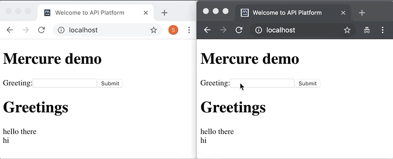

# Mercure demo

## What is this?

Mercure demo is brought to you by your friends at [Last Call Media](https://www.lastcallmedia.com), this is a demo project that's part of a video series I'll be publishing shortly.

It shows mercure with a super-simple react frontend POSTing to API Platform and receiving live updates from the mercure hub.

To test run `docker-compose up` and visit http://localhost/ in two, side-by-side browsers. Add a greeting message in one browser and you'll quickly see that message appear in the other.

## Resources

Other useful URLs after starting up the docker containers:
* Basic demo: http://localhost/
* The mercure demo/debugging url: http://localhost:9090/
* API Platform UI: http://localhost:8080/

Referenced projects:
* [mercure](https://github.com/dunglas/mercure)
* [API Platform](https://github.com/api-platform/api-platform)
* [client generator](https://github.com/api-platform/client-generator)
* [EventSource polyfill](https://github.com/Yaffle/EventSource/)
